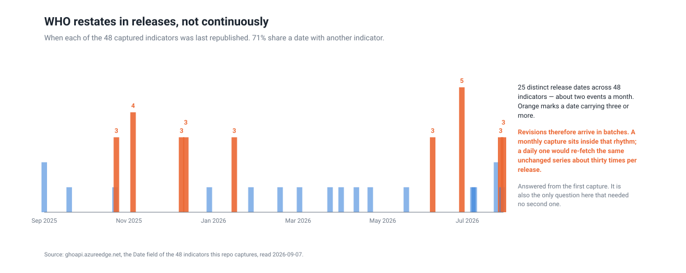
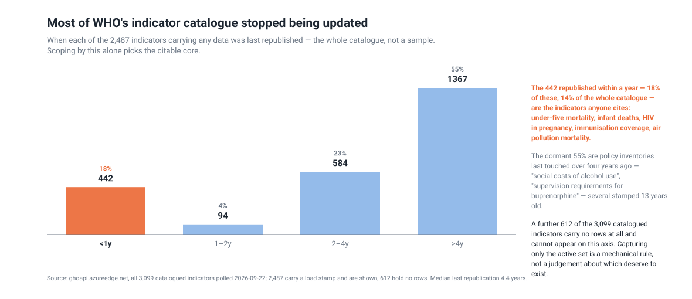
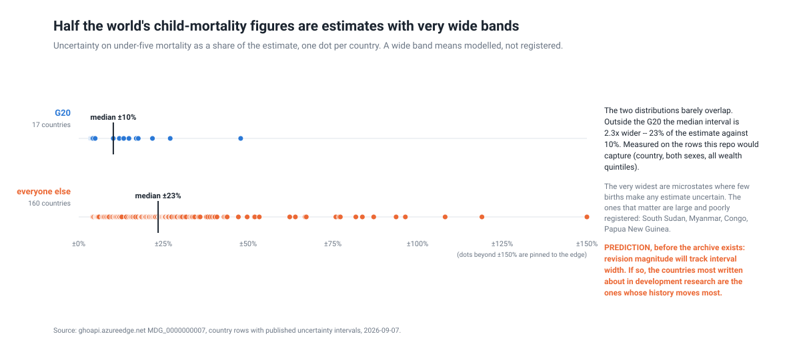
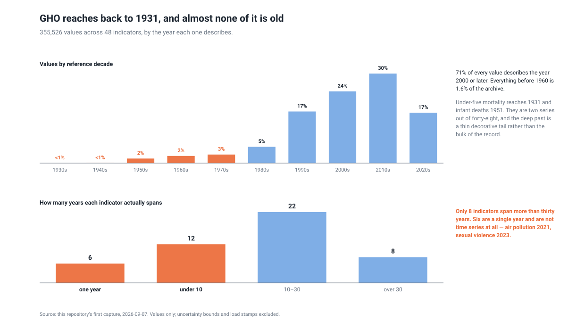

<h1 align="center">wss-gho</h1>

<p align="center">
  <strong>WHO rewrites its own history. This keeps what it said before.</strong>
</p>

<div align="center">

  <a href="https://github.com/q3dresearch/wss-gho/actions/workflows/capture-monthly.yml"></a>
  <a href="https://github.com/q3dresearch/wss-gho/commits"></a>
  <a href="https://github.com/q3dresearch/wss-gho/blob/main/LICENSE"></a>

</div>

<p align="center">
  <sub>fleet: <a href="https://github.com/q3dresearch/wss-engine">engine</a> · <a href="https://github.com/q3dresearch/wss-hugging-face">hugging face</a> · <a href="https://github.com/q3dresearch/wss-openrouter">openrouter</a> · <a href="https://github.com/q3dresearch/wss-cloud-footprint">cloud footprint</a> · <a href="https://github.com/q3dresearch/wss-mining-pipeline">mining</a> · <a href="https://github.com/q3dresearch/wss-forest-harvest">forest</a> · <a href="https://github.com/q3dresearch/wss-food-trace">food</a> · <strong>gho</strong></sub>
</p>

**Under-five mortality in Brazil in 1931 was 223.0 per 1,000. That figure was
written on 5 August 2026** — a 95-year-old number restated last month, along
with all 64,510 rows of that indicator.

Whatever it said before is gone. WHO's Global Health Observatory serves one
value per country-year, and a revision overwrites the previous one in place.
Every paper citing a WHO estimate cites a number that cannot now be checked.

This repository takes 48 indicators once a month and keeps what each one said.

## What one capture already shows

### WHO restates in releases, not continuously



25 distinct release dates across the 48 captured indicators, and **71% share a
date with another**. Revisions arrive in batches of three to five, roughly twice
a month — which is why the cadence is monthly. A daily capture would re-fetch
the same unchanged series about thirty times per release.

### Most of the catalogue is abandoned



Of 400 indicators drawn at random from the 3,098 in the catalogue, **14.2% were
republished within the last year** (95% CI 10.9–18.4%). The median indicator has
not been touched in **4.7 years**; 59% not in over four.

The active ones are what anyone cites — under-five mortality, infant deaths, HIV
in pregnancy, immunisation coverage. The dormant ones are policy inventories
like *"Existence of operational policy/strategy/action plan for hearing health"*,
which require asking 194 governments about their own laws and freeze the moment
that survey stops being funded.

**Scoping on that alone selects the citable core**, with no judgement about which
indicators deserve to exist.

### The figures most likely to be rewritten are the ones we can least check



Outside the G20 the published uncertainty band is **2.3× wider** — a median of
±23% of the estimate against ±10%. A wide band means the figure is modelled
rather than registered, and models are what change when they are updated.

> **Prediction, recorded before the archive can test it:** revision magnitude
> will track interval width, so the countries most written about in development
> research are the ones whose history moves most.

If that fails, the assumption behind this repo's scope is wrong. It is written
down so it can fail visibly.

### The history is shallower than "back to 1931" suggests



**71% of every value describes the year 2000 or later, and everything before
1960 is 1.6% of the archive.** Under-five mortality reaches 1931 and infant
deaths 1951; they are two series out of forty-eight.

Only **8 indicators span more than thirty years**, and **six are a single year**
— air pollution 2021, sexual violence 2023 — so they are not time series at all.
The deep past is a thin decorative tail, not the bulk of the record.

That does not weaken the case for capturing: what matters is that the values are
**restated**, not that they are old. But "WHO holds a century of history" would
be the wrong reading of the opening example.

## What the archive will answer that nothing can today

| question | needs |
| --- | --- |
| **How far does a restated number move?** | **two captures — first answer next month** |
| How far back does a revision reach: recent years, or the whole series? | two captures |
| Which countries' history is rewritten most? | a year |
| **Do SDG baselines move?** Progress is measured against 2015; if 2015 is revised, progress changes although nothing happened | two years |
| Are indicators ever *deleted* from the catalogue? A dormant one still shows; a removed one vanishes without trace | a year |

Full list with honest status in
[`docs/research-questions.md`](docs/research-questions.md).

**Nothing here has yet observed a revision.** The first capture is a baseline.
If next month's numbers come back identical, that is a finding too — and the
exit condition in the questions doc says to stop.

## Sources

48 indicators, one registry entry each, selected mechanically: every indicator
in a random 400-sample that had been republished within a year. Scope evidence
is in [`reference/`](reference/).

Captured whole — no dimension filtering. Filtering on a dimension an indicator
lacks returns **zero rows with no error**, and dimensions are not uniform:
under-five mortality carries SEX, AGEGROUP and WEALTHQUINTILE, measles
immunisation carries none and is not even country-keyed.

## Running it

```bash
pip install "wss @ git+https://github.com/q3dresearch/wss-engine.git@v0.6.2"
export WSS_CONTACT="https://github.com/q3dresearch/wss-gho"

wss validate                    # registry schema check; CI gate
wss capture --cadence monthly   # fetch → gate → hash → dedupe → write → manifest
wss derive                      # raw → derived/observations
python examples/charts.py       # the three charts above
```

Every observation carries `source_id` and `raw_ref`. The matching manifest row
holds that `raw_ref` with the URL, fetch time and a SHA-256 of exactly what came
back, so any number here traces to the bytes it came from.

## Notes for the next person

- **`observed_at` is the reference year, not the fetch time.** A row describes
  child mortality in 2005; that is when the observation is *about*. Using fetch
  time would stamp an unchanged series with a fresh timestamp every month and
  invent movement that never happened.
- **`Date` is carried as its own metric, `restated_at`.** It is WHO's load
  stamp — the evidence that a revision happened and when — and it moves
  independently of the value.
- **`Date` is stamped per load batch, not per row.** A series can hold rows with
  different dates, so `$top=1` returns an arbitrary one. `DEVICES20` answers
  2013-06-11 unsorted and 2022-12-12 with `$orderby=Date desc`. A poller using
  the naive form reports "unchanged" for ever.
- **`$top` caps at 1,000**, so every indicator pages.
- **Cold indicators take ~42 s.** Eight in parallel still return as a ~62 s
  batch — a server-side queue, not latency — so throughput is ~8/minute
  regardless of concurrency.
